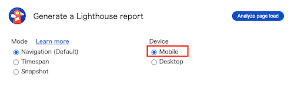

# sumai-speed-hackathon
住まいGで開催するスピードハッカソン用のリポジトリ

## Getting Started
```
npm i
npm run start
```

## ディレクトリ構成
```
(root)
├── public /* 静的ファイルの格納先 */
├── .gitignore /* Git で管理しないファイル・フォルダを設定するファイル */
├── app.js /* Expressでlocalhostを立ち上げ */
├── package.json /* プロジェクトの設定や依存関係を保存するファイル */
└── package-lock.json /* インストールされるパッケージの正確なバージョンを記録するファイル */
```

## ルール
localhostでLighthouseを動かして、Performanceスコアが高いチームが勝ち
（※PCが重いとスコアが下がるらしいので計測する時は注意）

計測する時、Deviceが「Mobile」になっているか確認お願いします



#### 1. 既存画面の動作を変えてはならない
仕様書は無いので、実際に動かして確認お願いします
画面描画に関係ないタグは削除してOK
#### 2. 高速化の方法は自由
ググるのOK！基本的には`/public/`配下や`app.js`をいじってください（ビルドツールを導入する、サーバーサイドのコードを変更するのもありです）
#### 3. Chrome以外のブラウザ（IEなど）の対策コードは消えていてもOK
